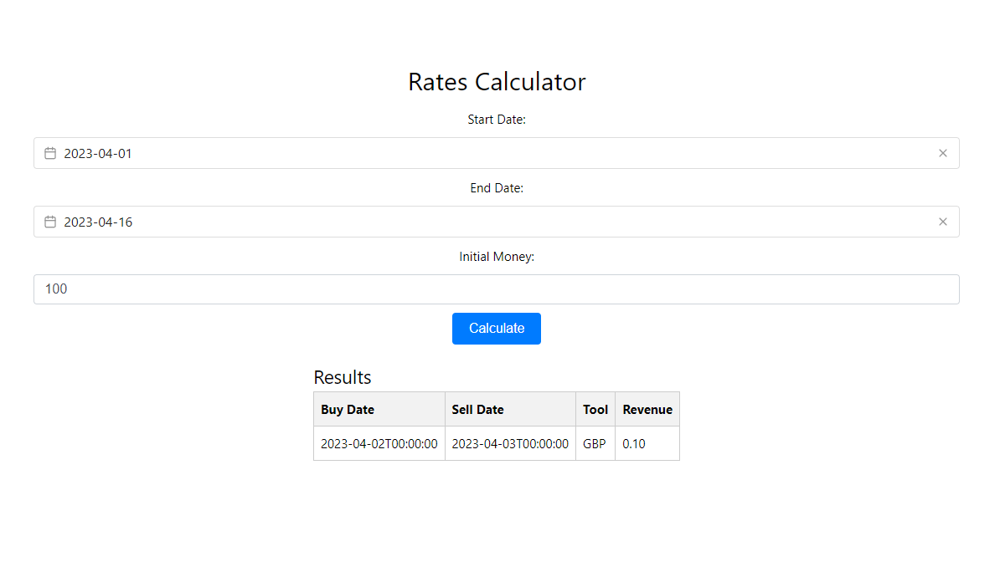

# Bad Broker

This project provides a solution for the Bad Broker problem, allowing users to find the best investment tool and revenue generated within a specific date range.



## Requirements

- .NET 5.0 or higher
- Node.js 14.x or higher
- Vue.js 3.x

## How to run the project

### Backend

1. Navigate to the backend folder in the terminal.
```
cd backend
```

2. Run the following command to restore the project dependencies and build the solution:
```
dotnet restore
dotnet build
```
3. Run the following command to start the API:
```
dotnet run
```

The API will be available at `https://localhost:7115`.

### Frontend

1. Navigate to the frontend folder in a different terminal.
```
cd frontend
```
2. Run the following command to install the project dependencies:
```
npm install
```

3. Run the following command to start the Vue.js development server:
```
npm run serve
```

The application will be available at `http://localhost:5173/`.

## Screenshot


